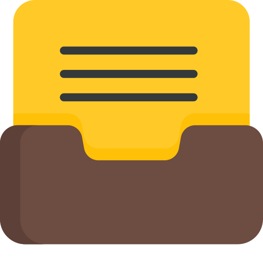
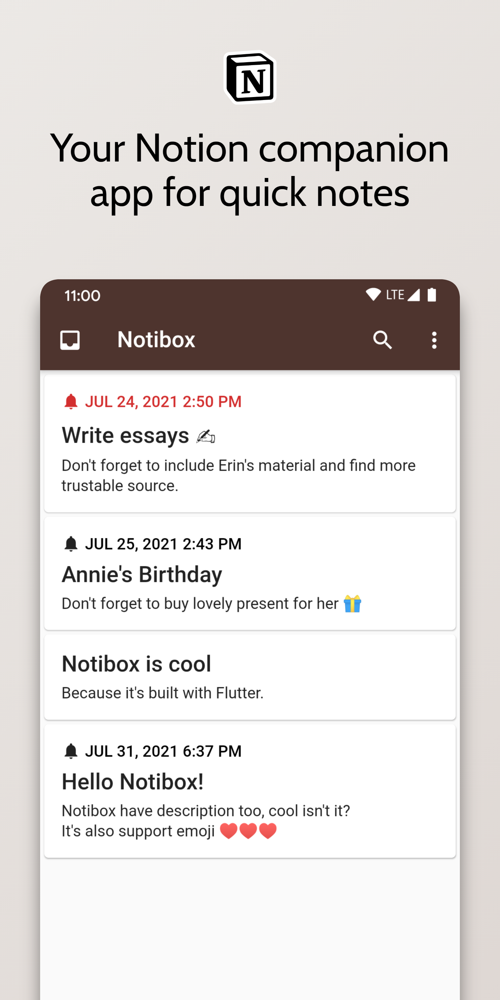
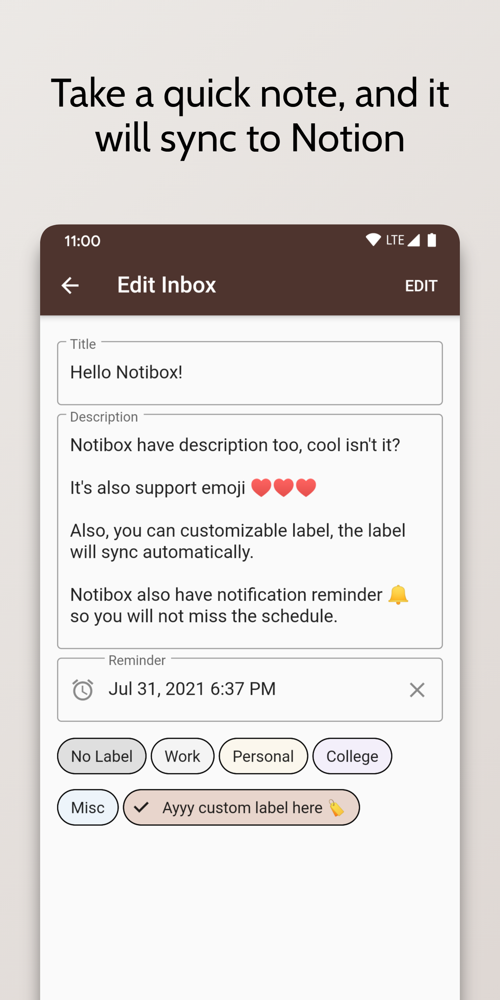
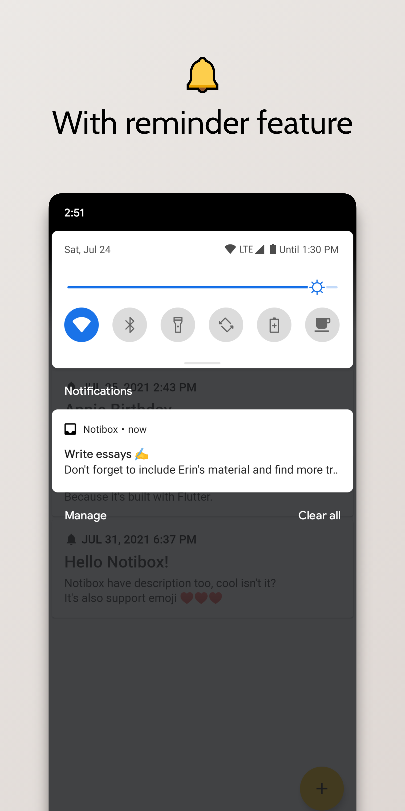
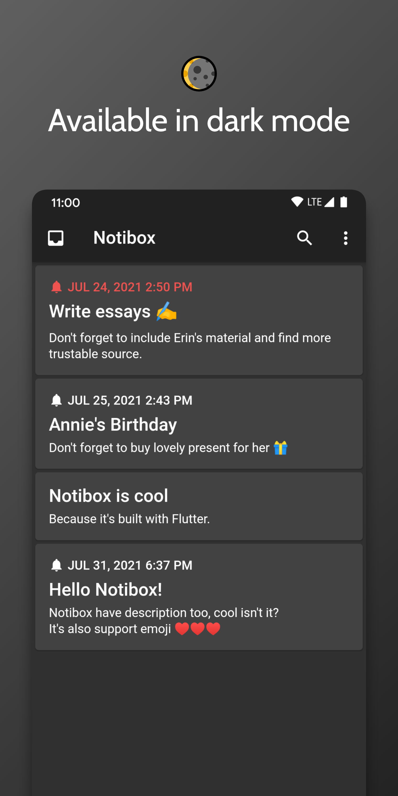

  
  <h1>Notibox</h1>
  
Simple app to store quick notes efficiently in Notion. Built with Flutter.

 

  
  
  

  

 

# Description
Notibox is an inbox application that integrates with Notion. Used to save your quick notes more quickly and efficiently. Notibox uses the [Notion API](https://developers.notion.com/) to work.

# Screenshots
<table >
  <tr>
    <td></td>
    <td></td>
    <td></td>
  </tr>
  <tr>
    <td></td>
    <td></td>
  </tr>
</table>

## Download

You can either download from [Play Store](#) or download the application from [Codemagic](https://codemagic.io/apps/60f521280c5097fa1bfce8d5/60fbe739be21229f0a9ce310/latest_build) by downloading **app-release.apk**.

# Features
- Offline, all notes will be available even when there is no network
- Reminder
- Inbox search feature
- Bidirectional sync
- Customizable label
- Many more!

# How to contribute
Any contribution are really appreciated. Here are some points where you can contribute to Notibox.
- Helping to create unit or widget tests (please do, I don't know how to do test properly)
- Report some bug 🪲
- Give us suggestions
- Add new functionality (please open an issue first to discuss what you would like to add)

## Localization
For localization, this app is only support in English, and soon in other language. If you are willing to add this feature, don't hesitate to make a PR.

##  Architecture
Notibox using GetX as state management, the structure itself is using directory by feature. It's still messy, feel free to open issues or PRs if you have any suggestions on the code.

## Getting Started
- Clone this package
- Get dependencies with `flutter pub get`
- Add Firebase `google-services.json` to `android/app`
- Run the app with `flutter run`

# License
Distributed under the Apache 2.0 License. See [LICENSE](/LICENSE) for more information.
